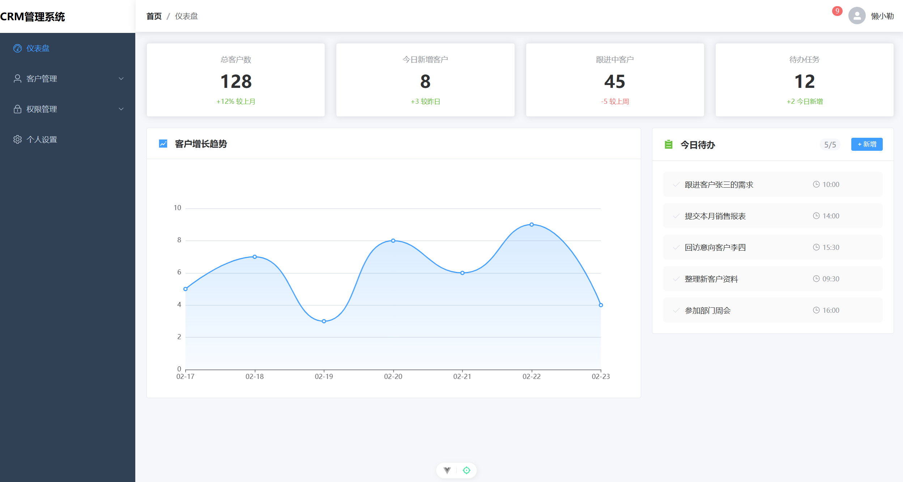
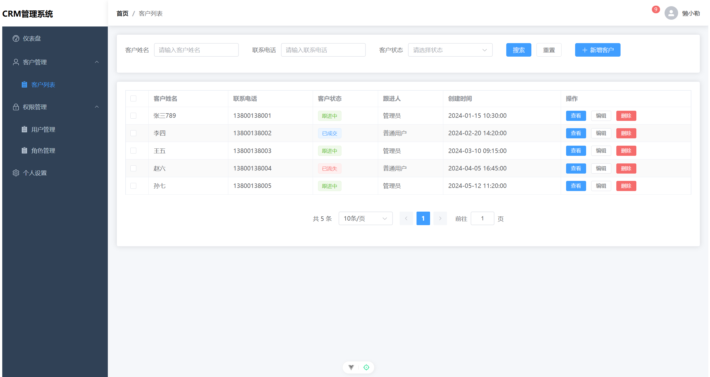
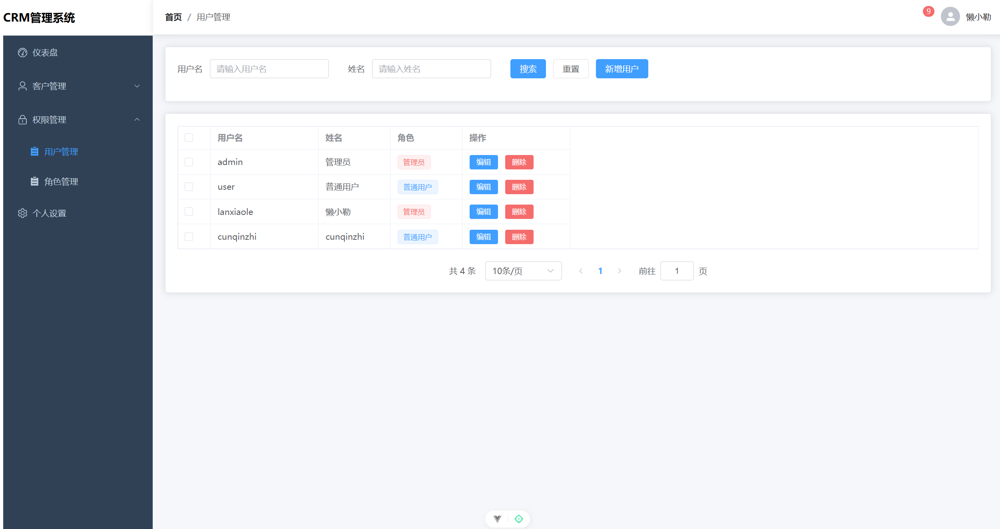
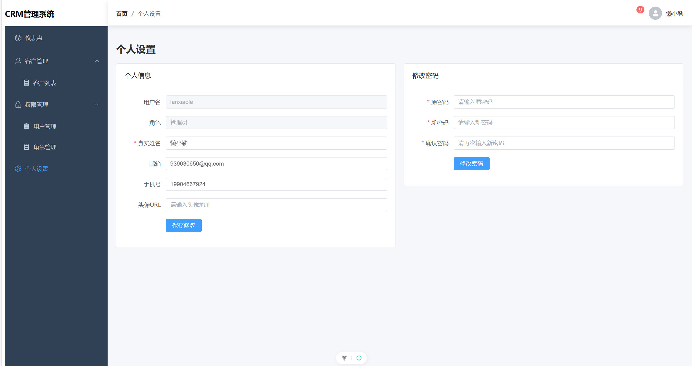

# CRM客户关系管理系统

一个基于Vue3 + Element Plus开发的轻量级客户关系管理系统，支持客户管理、用户管理、角色权限控制等核心功能，适合中小团队使用。

## 📚 目录

- [项目展示](#项目展示)
- [技术栈](#️-技术栈)
- [项目结构](#-项目结构)
- [快速启动](#快速启动)
- [核心功能模块实现](#核心功能模块实现)
  - [客户管理模块](#1-客户管理模块)
  - [用户管理模块](#2-用户管理模块)
  - [角色管理模块](#3-角色管理模块)
  - [权限控制模块](#4-权限控制模块)
  - [个人设置模块](#5-个人设置模块)
- [核心通用方法说明](#️-核心通用方法说明)
  - [useList 通用列表逻辑封装](#1-uselist-通用列表逻辑封装)
  - [Axios 请求封装](#2-axios-请求封装)
- [API 地址配置说明](#-api-地址配置说明)
- [常见问题解决方案](#常见问题解决方案)
- [版本更新记录](#版本更新记录)

## 项目展示

### 仪表盘



### 客户管理



### 权限管理




### 个人设置



## 🛠️ 技术栈

| 技术         | 版本   | 说明                                    |
| ------------ | ------ | --------------------------------------- |
| Vue          | 3.5.x  | 前端核心框架，Composition API语法       |
| Vite         | 7.3.x  | 构建工具，极速开发体验                  |
| Element Plus | 2.13.x | 企业级UI组件库，适配中后台系统          |
| Pinia        | 3.0.x  | 状态管理工具，替代Vuex                  |
| Vue Router   | 5.0.x  | 路由管理                                |
| Axios        | 1.13.x | HTTP请求库                              |
| json-server  | 1.0.x  | 轻量级Mock后端服务，快速搭建RESTful API |

## 📁 项目结构

```
CRM/
├── public/                 # 静态资源目录
├── src/
│   ├── api/                # 接口请求封装
│   │   ├── customer.js     # 客户相关接口
│   │   ├── user.js         # 用户相关接口
│   │   └── role.js         # 角色相关接口
│   ├── assets/             # 静态资源（样式、图片等）
│   ├── components/         # 公共组件
│   │   ├── Sidebar.vue     # 侧边栏菜单组件
│   │   ├── Navbar.vue      # 顶部导航栏组件
│   │   └── Breadcrumb.vue  # 面包屑导航组件
│   ├── composables/        # 组合式函数封装
│   │   └── useList.js      # 通用列表逻辑复用函数
│   ├── layouts/            # 布局组件
│   │   └── Layout.vue      # 整体布局组件（侧边栏+顶部导航+内容区）
│   ├── router/             # 路由配置
│   │   └── index.js        # 路由定义和全局守卫
│   ├── stores/             # Pinia状态管理
│   │   ├── counter.js      # 示例状态（可删除）
│   │   └── userStore.js    # 用户信息和权限状态管理
│   ├── utils/              # 工具函数
│   │   └── request.js      # Axios请求拦截器封装
│   ├── views/              # 页面组件
│   │   ├── DashboardView.vue       # 仪表盘首页
│   │   ├── CustomerListView.vue    # 客户列表页
│   │   ├── CustomerDetailView.vue  # 客户详情页
│   │   ├── CustomerFormView.vue    # 客户新增/编辑页
│   │   ├── UserManageView.vue      # 用户管理页
│   │   ├── RoleManageView.vue      # 角色管理页
│   │   ├── ProfileView.vue         # 个人设置页
│   │   ├── LoginView.vue           # 登录页
│   │   ├── ForbiddenView.vue       # 403无权限页
│   │   └── NotFoundView.vue        # 404页
│   ├── App.vue             # 根组件
│   └── main.js             # 项目入口文件
├── db.json                 # json-server数据库文件
├── package.json            # 依赖配置
└── vite.config.js          # Vite配置
```

## 快速启动

### 环境要求

- Node.js >= 16.0.0
- npm >= 8.0.0

### 安装依赖

```bash
npm install
```

### 启动后端服务（json-server）

```bash
npm run server
```

服务启动后地址：`http://localhost:3000`

### 启动前端开发服务

```bash
npm run dev
```

前端访问地址：`http://localhost:5173`

### 构建生产版本

```bash
npm run build
```

## 👤 默认测试账号

| 账号  | 密码   | 角色     | 权限                               |
| ----- | ------ | -------- | ---------------------------------- |
| admin | 123456 | 管理员   | 所有功能权限                       |
| user  | 123456 | 普通用户 | 仅可查看仪表盘、客户管理、个人设置 |

## 🎯 核心模块技术实现

### 1. 客户管理模块

**模块定位**：实现客户全生命周期管理，是系统的核心业务模块
**数据结构（customers表）**：
| 字段 | 类型 | 说明 |
|------|------|------|
| id | string | 唯一标识 |
| name | string | 客户姓名 |
| phone | string | 手机号 |
| email | string | 邮箱 |
| company | string | 所属公司 |
| status | string | 客户状态（potential/following/deal/lost） |
| createTime | string | 创建时间 |
| remark | string | 备注 |

**核心接口**：

- `GET /customers` - 获取客户列表（支持分页、搜索、过滤）
- `GET /customers/:id` - 获取客户详情
- `POST /customers` - 新增客户
- `PUT /customers/:id` - 修改客户
- `DELETE /customers/:id` - 删除客户

**关键实现**：

- 复用`useList`组合式函数实现列表的搜索、分页、筛选逻辑，避免重复代码
- 客户状态使用字典映射，前端统一维护状态枚举和显示文本
- 页面路由采用分层设计：列表页→详情页→表单页，通过路由参数传递客户ID

---

### 2. 用户管理模块

**模块定位**：系统账号和权限入口管理，仅管理员可访问
**数据结构（users表）**：
| 字段 | 类型 | 说明 |
|------|------|------|
| id | string | 唯一标识 |
| username | string | 登录用户名（唯一） |
| password | string | 登录密码 |
| name | string | 真实姓名 |
| role | string | 角色标识（关联roles表code字段） |
| phone | string | 手机号 |
| email | string | 邮箱 |
| status | number | 账号状态（1-启用 0-禁用） |
| token | string | 登录token |

**核心接口**：

- `GET /users` - 获取用户列表
- `POST /users` - 新增用户
- `PUT /users/:id` - 修改用户
- `PATCH /users/:id` - 局部更新用户信息
- `DELETE /users/:id` - 删除用户

**关键实现**：

- 页面初始化时动态请求角色列表，与角色模块解耦，角色新增/修改无需修改用户模块代码
- 密码字段在传输和存储时采用明文（演示项目，生产环境需加密）
- 账号禁用后登录时会自动校验状态，禁止登录

---

### 3. 角色管理模块

**模块定位**：权限体系的核心，实现角色与权限的关联
**数据结构（roles表）**：
| 字段 | 类型 | 说明 |
|------|------|------|
| id | string | 唯一标识 |
| name | string | 角色名称 |
| code | string | 角色标识（唯一，与用户表role字段关联） |
| description | string | 角色描述 |
| permissions | array[string] | 权限标识数组 |

**核心接口**：

- `GET /roles` - 获取角色列表
- `POST /roles` - 新增角色
- `PUT /roles/:id` - 修改角色
- `DELETE /roles/:id` - 删除角色

**关键实现**：

- 权限标识采用`模块:操作`的命名规范，可灵活扩展
- 新增角色时自动移除空ID字段，避免json-server生成数字ID导致的类型不一致问题
- 删除角色前校验是否有用户关联该角色，避免产生脏数据

---

### 4. 权限控制模块

**模块定位**：实现系统的权限校验和访问控制
**权限模型**：采用RBAC（基于角色的访问控制）三级模型：

> 用户 → 角色 → 权限

**实现方案**：

1. **路由级拦截**：全局路由守卫`beforeEach`中校验路由`meta.permission`字段，无权限则跳转到403页
2. **菜单级过滤**：侧边栏菜单根据当前用户权限动态渲染，无权限的菜单自动隐藏
3. **权限存储**：登录时获取用户角色对应的权限列表，存储在Pinia和localStorage中，避免重复请求

**关键逻辑**：

- 权限列表在登录时一次性获取，后续操作直接从本地读取，性能更高
- 修改角色权限后用户需重新登录生效，简化实现复杂度
- 公共页面（登录、404、403）无需权限校验，直接放行

---

### 5. 个人设置模块

**模块定位**：用户个人信息和密码管理
**核心接口**：

- `PATCH /users/:id` - 局部更新个人信息（只传修改的字段）
- `PATCH /users/:id` - 修改密码（仅传password字段）

**关键实现**：

- 采用`PATCH`请求实现局部更新，减少不必要的数据传输
- 修改信息后自动同步更新Pinia和localStorage，无需重新登录即可生效
- 密码修改时双重校验：原密码正确性校验、两次新密码一致性校验
- 双入口设计：顶部弹窗快速修改+页面内完整表单，满足不同使用习惯

---

## 🛠️ 核心通用方法说明

### 1. useList 通用列表逻辑封装

**文件路径**：`src/composables/useList.js`
**作用**：统一封装列表页的搜索、分页、数据获取逻辑，消除重复代码，所有列表页面都可以复用该方法。

#### 入参说明

| 参数名                    | 类型     | 必填 | 说明                                                               |
| ------------------------- | -------- | ---- | ------------------------------------------------------------------ |
| fetchApi                  | Function | 是   | 获取列表数据的API接口函数                                          |
| options                   | Object   | 否   | 配置选项                                                           |
| options.initialSearchForm | Object   | 否   | 搜索表单初始值，默认空对象                                         |
| options.defaultPageSize   | Number   | 否   | 默认每页条数，默认10                                               |
| options.customFilter      | Function | 否   | 自定义数据过滤函数，接收(原始数据, 搜索表单)参数，返回过滤后的数据 |

#### 返回值说明

```javascript
const {
  // 响应式数据
  tableData, // 表格数据（ref数组）
  total, // 数据总条数（ref数字）
  pageNum, // 当前页码（ref数字）
  pageSize, // 每页条数（ref数字）
  loading, // 加载状态（ref布尔值）
  searchForm, // 搜索表单（reactive对象）
  // 方法
  fetchData, // 获取数据方法，调用后重新请求接口
  handleSearch, // 搜索按钮触发方法，自动重置页码为1
  handleReset, // 重置按钮触发方法，清空搜索表单
  handlePageChange, // 页码切换方法，接收新页码
  handleSizeChange, // 每页条数切换方法，接收新条数
} = useList(fetchApi, options)
```

#### 使用示例

```javascript
import { useList } from '../composables/useList'
import { getCustomerListApi } from '../api/customer'

// 一行代码完成所有列表逻辑
const { tableData, total, pageNum, pageSize, loading, searchForm, fetchData } = useList(
  getCustomerListApi,
  {
    initialSearchForm: { name: '', phone: '', status: '' },
    defaultPageSize: 10,
  },
)
```

---

### 2. Axios 请求封装

**文件路径**：`src/utils/request.js`
**作用**：统一处理HTTP请求，包含请求拦截、响应拦截、错误统一处理。

#### 核心功能

- 自动添加请求头`Authorization`携带token
- 响应数据自动脱壳，直接返回接口返回的data部分
- 统一错误提示，网络错误、请求超时、HTTP错误码自动弹出提示
- 请求超时时间设置为10秒

#### 使用示例

```javascript
import request from '../utils/request'

// GET请求
export const getListApi = (params) => {
  return request({
```

---

## 📡 API 地址配置说明

### 本地开发环境配置

当前项目默认API地址为 `http://localhost:3000`，如需修改本地开发接口地址有两种方式：

1. **临时修改**：直接修改 `src/utils/request.js` 中的 `baseURL` 字段即可
2. **环境变量配置（推荐，适合多人协作/多环境）**：
   - 在项目根目录创建 `.env.development` 文件，添加以下内容：
     ```env
     VITE_API_BASE_URL = http://localhost:3000
     ```
   - 修改 `src/utils/request.js` 中的 baseURL 配置：
     ```javascript
     const service = axios.create({
       baseURL: import.meta.env.VITE_API_BASE_URL || 'http://localhost:3000',
       timeout: 10000,
     })
     ```
   - 重启开发服务即可生效，不同开发人员可以独立配置自己的本地接口地址无需修改代码

### 生产部署配置

生产环境配置环境变量即可，无需修改代码：

1. 在项目根目录创建 `.env.production` 文件：
   ```env
   VITE_API_BASE_URL = https://your-production-api.com
   ```
2. 执行 `npm run build` 打包时会自动读取生产环境配置

### 本地json-server端口修改

如果需要修改本地mock服务的启动端口：

1. 修改 `package.json` 中 `scripts.server` 字段的 `--port` 参数：
   ```json
   "server": "json-server --watch db.json --port 3001"
   ```
2. 修改 `.env.development` 中的 `VITE_API_BASE_URL` 端口和上面一致
3. 重启 `npm run server` 和 `npm run dev` 即可生效

---

## 版本更新记录

详细的版本更新记录请查看 [CHANGELOG.md](./CHANGELOG.md) 文件，包含各版本功能新增、优化、Bug修复等完整记录。

---

## 📋 其他API示例

```javascript
import request from '../utils/request'

// GET请求
export const getListApi = (params) => {
  return request({
    url: '/xxx',
    method: 'get',
    params, // 会自动拼接在url后面
  })
}

// POST请求
export const addApi = (data) => {
  return request({
    url: '/xxx',
    method: 'post',
    data, // 请求体数据
  })
}
```

---

### 3. 动态菜单过滤方法

**文件路径**：`src/components/Sidebar.vue`
**作用**：根据当前用户的权限列表，递归过滤出有权限访问的菜单，自动隐藏无权限的父菜单。

#### 实现逻辑

```javascript
const filterMenus = (menus) => {
  return menus.filter((menu) => {
    // 有子菜单的情况
    if (menu.children) {
      // 先过滤子菜单
      menu.children = filterMenus(menu.children)
      // 如果子菜单还有值，显示父菜单，否则隐藏
      return menu.children.length > 0
    }
    // 没有子菜单的情况，检查是否有该权限
    return userStore.permissions.includes(menu.permission)
  })
}
```

---

## 🐛 常见问题解决方案

### 1. 角色无法删除/编辑，报404错误

**问题原因**：角色ID类型不统一，db.json里角色ID是数字类型，其他表是字符串类型，json-server无法匹配。
**解决方案**：

- 将db.json里角色的ID改成字符串类型（加引号）
- 新增角色时移除空ID字段，让json-server自动生成字符串ID
- 重启json-server服务生效

### 2. 权限修改后不生效

**问题原因**：权限是在用户登录时获取并存储到本地的，修改角色权限后用户未重新登录。
**解决方案**：

- 修改角色权限后，要求对应用户重新登录
- 后续可以优化：添加权限更新通知，让用户手动刷新权限

### 3. json-server修改db.json后不生效

**问题原因**：json-server启动时会把db.json加载到内存，后续修改文件不会自动同步。
**解决方案**：

- 修改db.json后必须重启json-server服务
- 开发阶段可以使用`json-server --watch db.json`命令，自动监听文件变化重启服务

## 后续扩展方向

1. **按钮级权限控制**：实现`v-permission`指令，控制页面内按钮的显示隐藏
2. **头像上传功能**：对接OSS存储服务，支持头像本地上传和裁剪
3. **操作日志记录**：记录用户的重要操作（新增、删除、修改）
4. **数据导出**：支持客户列表、用户列表导出为Excel文件
5. **数据统计**：仪表盘增加客户增长、成交数据等统计图表
6. **多环境配置**：区分开发、测试、生产环境的接口地址
7. **密码加密**：前端密码加密传输，后端加密存储，提升安全性

## 贡献指南

欢迎提交 Issue 或 Pull Request。在提交 PR 前，请确保：

- 代码风格符合 ESLint 规则
- 提交信息清晰明了
- 如果是新功能，请更新相关文档

## 许可证

MIT License
